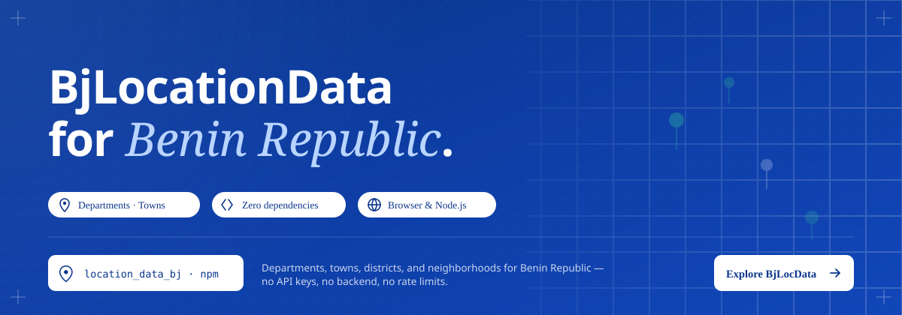

# location_data_bj

> Benin Republic administrative location data for JavaScript/TypeScript web and Node.js applications.

[](https://www.npmjs.com/package/location_data_bj)
[](https://www.npmjs.com/package/location_data_bj)
[](https://opensource.org/licenses/MIT)
[](https://www.typescriptlang.org/)

Covers the full four-level administrative hierarchy — **departments → towns → districts → neighborhoods** — with lookup, relational query, search, and an optional drop-in UI widget.

**Related packages**

| Platform | Package |
|---|---|
| Dart / Flutter | [location_data_bj](https://pub.dev/packages/location_data_bj) on pub.dev |
| Raw data | [bj_location_data_raw](https://github.com/Dahkenangnon/bj_location_data_raw) on GitHub |

---

## Table of Contents

- [Data Snapshot](#data-snapshot)
- [Demo](#demo)
- [Installation](#installation)
- [Quick Start](#quick-start)
- [API Reference](#api-reference)
  - [List All](#list-all)
  - [Lookup by Code](#lookup-by-code)
  - [Relational Queries](#relational-queries)
  - [Search](#search)
  - [Widget](#widget)
- [TypeScript Types](#typescript-types)
- [Contributing](#contributing)
- [Acknowledgments](#acknowledgments)
- [Disclaimer](#disclaimer)
- [License](#license)

---

## Data Snapshot

> Last updated: 2023-12-21

| Level | Count |
|---|---|
| Departments | 12 |
| Towns | 77 |
| Districts | 546 |
| Neighborhoods | 5 303 |

> **Note:** The `code` field in each record is an auto-generated identifier. See [bj_location_data_raw](https://github.com/Dahkenangnon/bj_location_data_raw) for the raw source and generation details.

---

## Demo

Live demo: [https://dahkenangnon.github.io/location_data_bj_js/](https://dahkenangnon.github.io/location_data_bj_js/)

---

## Installation

```bash
# npm
npm install location_data_bj

# yarn
yarn add location_data_bj

# pnpm
pnpm add location_data_bj
```

**Browser — CDN**
```html
<script src="https://unpkg.com/location_data_bj@1.0.4/public/dist/bundle.js"></script>
```

**Browser — local bundle**

Download the latest release from [GitHub Releases](https://github.com/Dahkenangnon/bj_location_data/releases/latest), then:
```html
<script src="path/to/location_data_bj.js"></script>
```

---

## Quick Start

```ts
import {
  departmentList,
  townsOfDepartment,
  searchNeighborhoods,
} from 'location_data_bj';

// List all departments, sorted A → Z (default)
const departments = departmentList();

// Get every town in a specific department
const towns = townsOfDepartment('DEP-01');

// Search neighborhoods by name
const results = searchNeighborhoods('Zongo');
```

---

## API Reference

All functions that return collections accept an optional `sortBy` parameter (`'asc'` | `'desc'`, default `'asc'`) that sorts results alphabetically by `name`.

### List All

| Function | Returns | Description |
|---|---|---|
| `departmentList(sortBy?)` | `IDepartment[]` | All departments |
| `townsList(sortBy?)` | `ITown[]` | All towns |
| `districtList(sortBy?)` | `IDistrict[]` | All districts |
| `neighborhoodList(sortBy?)` | `INeighborhood[]` | All neighborhoods |

```ts
import { departmentList, neighborhoodList } from 'location_data_bj';

const departments = departmentList('asc');
const neighborhoods = neighborhoodList('desc');
```

### Lookup by Code

| Function | Returns | Description |
|---|---|---|
| `department(code)` | `IDepartment \| undefined` | Department by code |
| `town(code)` | `ITown \| undefined` | Town by code |
| `district(code)` | `IDistrict \| undefined` | District by code |
| `neighborhood(code)` | `INeighborhood \| undefined` | Neighborhood by code |

```ts
import { department, town } from 'location_data_bj';

const dept = department('DEP-01');   // IDepartment | undefined
const t    = town('TWN-001');        // ITown | undefined
```

### Relational Queries

| Function | Returns | Description |
|---|---|---|
| `townsOfDepartment(departmentCode, sortBy?)` | `ITown[]` | Towns belonging to a department |
| `districtsOfTown(townCode, sortBy?)` | `IDistrict[]` | Districts belonging to a town |
| `neighborhoodsOfDistrict(districtCode, sortBy?)` | `INeighborhood[]` | Neighborhoods belonging to a district |

```ts
import { townsOfDepartment, districtsOfTown, neighborhoodsOfDistrict } from 'location_data_bj';

const towns         = townsOfDepartment('DEP-01');
const districts     = districtsOfTown('TWN-001');
const neighborhoods = neighborhoodsOfDistrict('DIS-001');
```

### Search

| Function | Returns | Description |
|---|---|---|
| `searchData(query, sortBy?)` | `BjLocationData[]` | Full-text search across all levels |
| `searchDepartments(query, sortBy?)` | `IDepartment[]` | Search departments by name |
| `searchTowns(query, sortBy?)` | `ITown[]` | Search towns by name |
| `searchDistricts(query, sortBy?)` | `IDistrict[]` | Search districts by name |
| `searchNeighborhoods(query, sortBy?)` | `INeighborhood[]` | Search neighborhoods by name |

```ts
import { searchData, searchTowns } from 'location_data_bj';

const allMatches = searchData('Cotonou');  // searches all levels
const towns      = searchTowns('Abomey');
```

### Widget

`init(options: BjLocationWidgetOptions): void`

Mounts a cascading location-selector widget (department → town → district → neighborhood) inside any DOM element.

```ts
import { init } from 'location_data_bj';

init({
  holderQuerySelector: '#location-widget',
  departmentSelectLabel: 'Select a department',
  townSelectLabel:       'Select a town',
  districtSelectLabel:   'Select a district',
  neighborhoodSelectLabel: 'Select a neighborhood',
  useDefaultSelect: false,
});
```

For a full working example see [public/index.html](public/index.html).

---

## TypeScript Types

```ts
interface IDepartment {
  code: string;
  name: string;
}

interface ITown {
  code: string;
  name: string;
  department_code: string;
}

interface IDistrict {
  code: string;
  name: string;
  town_code: string;
}

interface INeighborhood {
  code: string;
  name: string;
  district_code: string;
}

type BjLocationData = (IDepartment | ITown | IDistrict | INeighborhood) & { type?: string };
```

All types are exported from the package and can be imported directly:

```ts
import type { IDepartment, ITown, IDistrict, INeighborhood, BjLocationData } from 'location_data_bj';
```

---

## Contributing

Contributions are welcome! Please follow these steps:

1. Fork the repository
2. Create a feature branch: `git checkout -b feat/your-feature`
3. Commit your changes following [Conventional Commits](https://www.conventionalcommits.org/)
4. Run the test suite: `npm test`
5. Open a Pull Request

For data corrections or additions, please open an issue or contribute directly to [bj_location_data_raw](https://github.com/Dahkenangnon/bj_location_data_raw).

---

## Acknowledgments

- [Jude AGBODOYETIN](https://github.com/Jude200) — data cleaning and validation
- [Yanel Aïna](https://github.com/yanelaina) — data cleaning and validation
- [Junior Gantin (nioperas06)](https://github.com/nioperas06) — original territorial division dataset ([bj-decoupage-territorial](https://github.com/nioperas06/bj-decoupage-territorial))

---

## Disclaimer

The dataset is **not official government data**. It is derived from community-maintained sources. Use it for informational and development purposes. For authoritative administrative boundaries, consult the relevant Beninese government institutions.

---

## License

MIT © [Justin Y. Dah-Kenangnon](https://dah-kenangnon.com)

See [LICENSE](LICENSE) for the full text.
